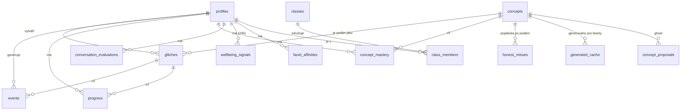

# Návrh struktury databáze

_Jak ukládat obsah, signály a preference tak, aby si z toho doporučovací systém mohl brát data. **Návrh k odsouhlasení** — konkrétní SQL migrace přijde, až schválíš směr. Vytvořeno: 2026-07-23._

Navazuje na [`doporucovaci-system.md`](./doporucovaci-system.md), [`typy-obsahu.md`](./typy-obsahu.md) a [mapu konceptů](../knowledge-map/). DB je **Supabase (PostgreSQL) + RLS**, jak už teď.

---

## Vůdčí zásady (jak se principy promítají do schématu)

1. **Zdroj pravdy zůstává git.** `core` obsah (koncepty, kanonické Glitche) žije dál v MD/YAML v repu. DB drží **signály, preference, komunitní a generovaný obsah** a **metadata pro řazení**. (Dle p-book: „git remaining the canonical home of core content".)
2. **Emoční data jsou efemérní.** Mood, pozornost, frustrace → jen **24 h**, pak se mažou automaticky. Nikdy netvoří trvalý štítek.
3. **Do profilu jde důkaz o učení, ne názor ani nálada.** Zvládnuté koncepty a kvalita argumentace ano; postoj na citlivé téma ne.
4. **Soukromí jako výchozí stav.** Osobní signály **nejsou veřejně čitelné** (RLS: vidí je jen jejich vlastník a případně učitel dané třídy). Žádné veřejné lajky/žebříčky → v DB pro ně není místo.
5. **Trust ladder je stav položky.** `private → community → edited → core` (+ `generated`, + `ghost` pro navržené koncepty); mění se jen kurátorským krokem.

> ⚠️ **K nápravě u stávajících tabulek:** `progress` má dnes politiku „Anyone can read" a `activity_log` „Admins can read all (using true)". To je proti zásadě 4 — v návrhu níže to zpřísňuji (čte jen vlastník / učitel).

---

## Přehled (ER)

---

## A. Uživatelé a role

### `profiles` *(rozšíření stávající)*
| sloupec | typ | popis |
| --- | --- | --- |
| `id` | uuid PK → auth.users | uživatel |
| `display_name` | text | jméno |
| `avatar` | text | odkaz/emoji |
| `role` | enum `zak\|ucitel\|editor\|admin` | oprávnění (viz karta Role) |
| `created_at` | timestamptz | |

> Role řídí, kdo smí editovat obsah (`editor`/`admin`), kdo přidávat komunitní Glitch (`zak`/`ucitel`), kdo vidí třídu (`ucitel`).

### `classes`, `class_members` *(pro učitele — lze odložit)*
- `classes`: `id`, `name`, `owner` (učitel), `created_at`.
- `class_members`: `class_id`, `user_id`, `role_in_class` (`zak`/`ucitel`), unikát `(class_id,user_id)`.
- Umožní učiteli vidět **důkaz o učení** svých žáků (ne emoční data).

---

## B. Obsah (katalog): koncepty, Glitche, fasety

### `concepts` *(zrcadlo mapy konceptů)*
Synchronizováno z `knowledge-map.yaml` (zdroj pravdy je mapa; sem se sype odvozenina pro rychlé dotazy doporučovače).
| sloupec | typ | popis |
| --- | --- | --- |
| `id` | text PK | id konceptu z mapy (`umela-inteligence-doporucovaci-systemy`) |
| `oblast` | text | RVP okruh |
| `tema` | text | obsahové téma |
| `vrstva` | enum `core\|navazujici` | |
| `rvp` | jsonb | `[{kod, vystup}]` |
| `digi_kompetence` | text | |
| `prerekvizity` | text[] | id konceptů |
| `souvisi` | text[] | id konceptů |

### `glitches` *(= „telling", jedno podání konceptu)*
Jádro katalogu. `core` řádky se generují z MD v gitu; `community`/`generated` vznikají v DB.
| sloupec | typ | popis |
| --- | --- | --- |
| `id` | text PK | slug Glitche |
| `type` | enum | `basic\|rychla-vyzva\|wellbeing\|funfact\|najdi-chybu\|historicka-osobnost\|argument` |
| `concept_id` | text FK → concepts | čí koncept podává (u wellbeing/rozcvičky může být NULL) |
| `trust_state` | enum `private\|community\|edited\|core\|generated\|ghost` | žebřík důvěry |
| `visibility` | enum `soukrome\|sdilene_anon\|sdilene_jmeno` | soukromí (zásada 4) |
| `author_id` | uuid FK → profiles | autor |
| `created_at` | timestamptz | datum vytvoření |
| `title`, `badge` | text | karta ve feedu |
| `body` | jsonb/text | obsah (u DB obsahu; u `core` odkaz na git) |
| `source` | enum `git\|db` | odkud se servíruje |
| **`obtiznost`** | smallint 1–3 | volí se u Glitche |
| **`kognitivni_narocnost`** | enum (Bloom) `zapamatovat\|porozumet\|aplikovat\|analyzovat\|hodnotit\|vytvorit` | |
| **`typ_zateze`** | enum `soustredeni\|kreativita\|relaxace\|rozcvicka` | |
| **`delka`** | enum `mikro\|kratka\|standard\|deep` | |
| **`facets`** | jsonb | fasetový vektor (svět, hloubka, vizualita, formalismus, žánr, jazyk, nosiče) — GIN index |
| `fork_allowed` | bool | |

> **Proč `facets` jako jsonb:** doporučovač i generování pracují s celým fasetovým vektorem; jsonb + GIN index umožní dotaz „najdi podání konceptu X s `vizualita=visual-first, delka=tl;dr`". Klíčové osy (obtížnost, Bloom) jsou vlastní sloupce kvůli rychlému párování s mood stavem.

### `glitch_concepts` *(M:N, volitelné)*
Jedno podání může sloužit více konceptům: `glitch_id`, `concept_id`, `covers` (jsonb — které povinné body pokrývá).

---

## C. Signály a chování (implicitní vstup doporučovače)

### `events` *(nástupce `activity_log`)*
Append-only log událostí = zdroj implicitních signálů. Ne-emoční, trvalé.
| sloupec | typ | popis |
| --- | --- | --- |
| `id` | uuid PK | |
| `user_id` | uuid FK | |
| `glitch_id` | text FK | co se dělo (NULL u systémových) |
| `event_type` | enum `zobrazeni\|otevreni\|dokonceni\|kviz\|steer\|fork\|sdileni\|honest_miss` | |
| `payload` | jsonb | detail (odpověď kvízu, cílový fasetový vektor u steer…) |
| `session_id` | uuid | relace |
| `created_at` | timestamptz | |

> **Doba čtení** = odvozená z dvojice událostí `otevreni`/`dokonceni` (slabý signál preference délky/vizuality), ne cíl sám o sobě (zásada „kvalita ≠ délka").

### `progress` *(rozšíření stávající)*
Zvládnutí konkrétního Glitche. **Zpřísnit RLS na vlastníka + učitele.**
| sloupec | typ | popis |
| --- | --- | --- |
| `user_id`, `glitch_id` | PK | |
| `completed` | bool | |
| `uroven` | enum `jednoducha\|stredni\|master` | zvolená úroveň vypracování |
| `quiz_answer` | text | |
| `completed_at` | timestamptz | |

### `concept_mastery` *(důkaz o učení → profil / Tiny)*
Agregace přes Glitche: kam až žák v konceptu došel.
| sloupec | typ | popis |
| --- | --- | --- |
| `user_id`, `concept_id` | PK | |
| `uroven` | enum (Bloom/Marzano) | dosažená úroveň |
| `updated_at` | timestamptz | |
| `posilano_do_tiny` | bool | export důkazu o učení |

### `conversation_evaluations` *(výstup hodnoticího AI asistenta)*
Formativní vyhodnocení chatu — **strukturované signály, ne přepis, ne názor.**
| sloupec | typ | popis |
| --- | --- | --- |
| `id` | uuid PK | |
| `user_id`, `glitch_id`, `session_id` | | |
| `kriteria` | jsonb | `{dal_duvod:true, uvedl_priklad:true, zvazil_protiargument:false, shrnul:true}` |
| `dokonceno` | bool | absolvovaná smyčka |
| `created_at` | timestamptz | |

> Přepis konverzace se **neukládá** jako trvalý (emoční data), ukládá se jen výsledek posouzení proti kritériím.

---

## D. Wellbeing signály (efemérní, 24 h)

### `wellbeing_signals`
| sloupec | typ | popis |
| --- | --- | --- |
| `id` | uuid PK | |
| `user_id` | uuid FK | |
| `kind` | enum `mood\|attention\|breathing` | |
| `energy`, `focus` | smallint 0–100 | u mood |
| `value` | jsonb | u ostatních (skóre hry…) |
| `session_id` | uuid | |
| `created_at` | timestamptz | |
| `expires_at` | timestamptz | `created_at + 24h` |

> **Automatické mazání** naplánovanou úlohou (`pg_cron`: `delete from wellbeing_signals where expires_at < now()`). Tyto signály **upravují jen dnešní feed** (obtížnost, poměr wellbeing/her), nikdy se neagregují do profilu. Nahrazuje dnešní `mood_entries`.

---

## E. Model preferencí (open learner model) — fasetové afinity

### `facet_affinities`
Naučené i zvolené preference faset. **Explicitní volba přebíjí implicitní.** Editovatelné uživatelem.
| sloupec | typ | popis |
| --- | --- | --- |
| `user_id` | uuid FK | |
| `facet_dimension` | text | `vizualita`, `delka`, `svet`… |
| `facet_value` | text | `visual-first`… |
| `weight` | real | síla preference |
| `source` | enum `explicitni\|implicitni` | provenience |
| `updated_at` | timestamptz | |
| PK | `(user_id, facet_dimension, facet_value)` | |

> Z těchto řádků plyne **cílový fasetový vektor** uživatele → výběr podání (nebo požadavek na generování). Tvůj „preferenční Glitch" (obrázky vs. text) zapisuje `source=explicitni`.

---

## F. Elastický katalog: generování a poptávka

### `generated_cache` *(podání generovaná na vyžádání)*
Cache dle **fasetového vektoru** — segmentová, ne per-uživatel.
| sloupec | typ | popis |
| --- | --- | --- |
| `id` | uuid PK | |
| `concept_id` | text FK | |
| `facet_hash` | text | hash fasetového vektoru (klíč cache) |
| `facets` | jsonb | |
| `body` | jsonb | vygenerovaný obsah |
| `gate_passed` | bool | prošlo kontrolní bránou (povinné body, zákazy, zdroj pravdy) |
| `usage_count`, `last_used` | | pro retireování nepoužívaných |
| `created_at` | timestamptz | |

### `honest_misses` *(poptávka po neexistujícím podání)*
| sloupec | typ | popis |
| --- | --- | --- |
| `concept_id` | text FK | |
| `facets` | jsonb | co bylo žádané a neexistuje |
| `count` | int | kolikrát |
| `last_requested` | timestamptz | |

> Řazený seznam „žádáno, neposloužilo" = vstup pro redakci/generování (co dopsat).

### `concept_proposals` *(ghost koncepty)*
Navržené, ještě nenapsané koncepty; hlasy měří poptávku dřív, než někdo píše: `id`, `navrh` (jsonb, vč. kontraktu), `votes`, `created_by`, `created_at`.

---

## G. Komunita a kurátorský žebřík

- Žebřík řídí `glitches.trust_state` + `visibility`. **Sdílení vyžaduje souhlas** (výchozí anonymně) — přechod `private → community`.
- **Editorská fronta** = pohled (view) nad `glitches` + `events` + `honest_misses`: co nominovat (dost čtenářů zaujalo), co je „nezdravé", co dopsat.
- Adopce = editor/admin změní `trust_state` na `edited`/`core` (u `core` se obsah přenese do gitu jako kanonický).
- Stávající `community_tips`/`teams`/… jsou dědictví staré appky — **rozhodnout**, zda je zachovat, migrovat do `glitches`, nebo utlumit.

---

## H. Vazba na Tiny

Exportní plocha „důkaz o učení" = `concept_mastery` + `conversation_evaluations` (kvalita, ne obsah). Emoční data ani názory se do Tiny **neposílají**. Detail synchronizace = samostatné téma.

---

## RLS a soukromí (shrnutí)

| tabulka | čte | zapisuje |
| --- | --- | --- |
| `profiles` | vlastník (+ učitel své třídy) | vlastník |
| `events`, `progress`, `concept_mastery`, `conversation_evaluations` | **vlastník (+ učitel své třídy)** | vlastník (systém) |
| `wellbeing_signals` | **jen vlastník** | vlastník; mazání cron |
| `facet_affinities` | vlastník | vlastník |
| `glitches` (core/edited/community) | všichni (dle `visibility`) | autor / editor |
| `glitches` (private) | jen autor | autor |
| `generated_cache`, `honest_misses`, `concept_proposals` | čtení systém/editor | systém |

Žádná tabulka s osobními signály nemá veřejné čtení (oprava proti dnešnímu stavu).

---

## Otevřené otázky k rozhodnutí

1. **Koncepty a core Glitche v DB, nebo jen v gitu?** Návrh: git = pravda, DB = zrcadlo pro dotazy (sync skriptem). Souhlas?
2. **Třídy/učitel teď, nebo později?** Schéma je připravené, ale `classes` můžeme odložit.
3. **Stará komunita** (`community_tips`…) — zachovat, migrovat, nebo utlumit?
4. **`facets` jako jsonb vs. samostatná tabulka** — návrh jsonb + GIN; ok?
5. **Kdy zapnout generování/cache** (tabulky F) — postavit rovnou, nebo až po ručním katalogu?

---

## Další krok

Až schválíš směr, připravím **SQL migraci** (idempotentní, jako `setup-community.sql`) po skupinách — nejdřív A–E (profil, obsah, signály, wellbeing, preference), F–G až později. Nasadíš ji v Supabase SQL editoru.
