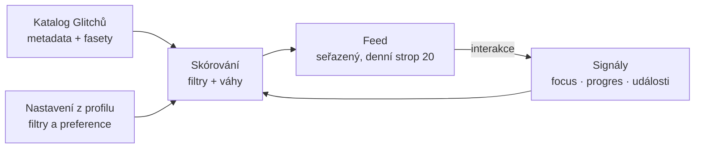

# Doporučovací systém — implementace (v1)

_Jak postavit **základy** doporučování už teď, klientsky a transparentně. Navazuje na [`doporucovaci-system.md`](./doporucovaci-system.md) (principy + model) a [`databaze-navrh.md`](./databaze-navrh.md) (schéma). Vytvořeno: 2026-07-24._

## Shrnutí: co jde postavit hned

**Ano — v1 základ postavíme klientsky, bez serveru a bez Recombee.** Feed dnes běží z pevného pole `CARDS` v `js/feed.js`. Stačí ho udělat **data-driven** (číst katalog Glitchů), doplnit **sběr signálů** a přidat **jednoduchou, vysvětlitelnou skórovací funkci**, která feed seřadí podle principů a nastavení uživatele.

Recombee / server-side (paper p-book) je **výhled** — produkční engine, který se učí z chování napříč uživateli. v1 je záměrně jednoduchý a průhledný, což přesně sedí na principy 3 (transparentnost) a 5 (kvalita = pokrok).

---

## Architektura (4 vrstvy)

1. **Katalog** — co všechno existuje (Glitche + jejich metadata pro řazení).
2. **Signály** — co o uživateli víme (**behaviorální focus** = dokončené aktivity, pokrok, chování). ⚠️ **Žádné rozpoznávání emocí** (AI Act) — mood/nálada se **neměří**.
3. **Skórování** — tvrdé filtry + měkké váhy → pořadí.
4. **Feed** — výsledný seřazený proud s denním stropem.

---

## 1. Katalog Glitchů (data-driven feed)

Nahradit pevné `CARDS` **manifestem** `glitches/feed.json`, který feed načítá za běhu (později generovaný z MD frontmatteru). Každá položka nese pole potřebná pro řazení:

| pole | k čemu |
| --- | --- |
| `id`, `type`, `category` | identita a typ karty |
| `concept_id`, `prerekvizity` | řazení dle mapy konceptů (nezobrazit pokročilé před základy) |
| `trust_state` | filtr „Od koho vidím obsah" (Core/Fork/Komunita/Generovaný) |
| `obtiznost`, `kognitivni_narocnost` | párování s tempem (behaviorální focus) |
| `typ_zateze`, `delka` | vyváženost feedu |
| `facets` | preference uživatele (vizualita, délka, svět…) |
| `wellbeing` (bool) | wellbeing karty pro proložení |
| render data (title, body, viz…) | vykreslení karty |

> Zdroj pravdy zůstává git (MD). Manifest je jen odvozenina pro rychlé čtení ve feedu (jako `concepts` zrcadlí mapu).

## 2. Sběr signálů

Co logovat (většina tabulek už existuje z migrace A–E):

| signál | kam | stav |
| --- | --- | --- |
| zobrazení / otevření / dokončení / kvíz | `activity_log` (události) | částečně (`sbTrackEvent`) |
| dokončení Glitche + úroveň | `progress` | ano (`sbSaveGlitchDone`) |
| focus (dokončení relaxační / pozornostní aktivity) | `focus_signals` (24 h) | ⚠️ výhled — mood_selector odstraněn (AI Act), signál je nově čistě behaviorální; dead kód `sbSaveMood`/`mood_entries` k odstranění |
| fasetové preference | `facet_affinities` / `profiles.settings` | částečně (nastavení) |

Zásady: **žádné rozpoznávání emocí** (AI Act) — focus = jen behaviorální fakt „splněno"; do profilu jde **důkaz o učení**, ne nálada (viz principy).

## 3. Skórovací funkce v1

Čistá funkce `serazFeed(katalog, signaly, nastaveni) → [glitche]`. Dvě fáze:

### 3.1 Tvrdé filtry (co se vůbec nesmí ukázat)
- **Denní strop 20** — víc karet se nenabídne, feed končí Shrnutím.
- **Už dokončené** Glitche pryč (nebo dozadu).
- **Prerekvizity** — nezobrazit koncept, jehož předpoklady nejsou splněné.
- **„Od koho vidím obsah"** — odfiltruj podle přepínačů (Core/Komunita/Generovaný).
- **Wellbeing gating** — když má uživatel vypnuté časovače, ty prvky vynech. *(mood_selector úplně odstraněn — AI Act, nezobrazuje se vůbec.)*

### 3.2 Měkké skóre (pořadí zbytku)
Součet vážených složek, každá vysvětlitelná:

| složka | pravidlo |
| --- | --- |
| **Shoda s tempem (focus)** | obtížnost vs. **behaviorální focus** (dokončil-li relaxační / pozornostní aktivity) — po oddechu → možné složitější; jinak proložit lehčím + wellbeing. ⚠️ **Nikdy z odhadu emoce** (AI Act); future-facing, až bude aktivit víc |
| **Fasetová shoda** | podání blízké preferencím (vizualita, délka…) z `facet_affinities` + togglů (měkké postrčení, ne filtr) |
| **Zájmy** | témata z chips (profil) nahoru |
| **Novost / rozmanitost** | nestřídat pořád stejný typ; neopakovat téma za sebou |
| **Vyváženost zátěže** | proložit soustředění / kreativitu / relaxaci; wellbeing karta jednou za čas |
| **Návaznost questu** | v rámci tématu držet Bloomův oblouk (znalostní → aplikační) |

### 3.3 Skládání feedu
- Nezačínat nejtěžším Glitchem; „rozehřát" (rozcvička / lehčí).
- Wellbeing (dýchání/pozornost/ASMR) proložit, ne na jednu hromadu.
- Po 20 → karta **Shrnutí**.

## 4. Napojení nastavení (už teď)

Nastavení z profilu (`profiles.settings` / localStorage) vstupují do skórování:
- **filtry:** „Od koho vidím obsah", časovače. *(mood check-in odstraněn — AI Act.)*
- **váhy:** „Mám raději delší texty", „Lépe se učím pomocí obrázků" → fasetové preference. „Obsah dle mých interakcí" → zapnout/vypnout implicitní učení.

## Fáze implementace

1. ✅ **Manifest katalogu** `glitches/feed.json` + feed čte data-driven (fallback = vestavěný `CARDS`). *(Pozor: `glitches/_archiv/index.json` je stará struktura misí (archiv).)*
2. ✅ **Skórovací modul** `js/recommender.js` — čistá funkce `serazFeed(cards, ctx)`: tvrdé filtry (denní strop, „od koho vidím obsah", dokončené; navíc tvrdě odfiltruje `mood_selector` — AI Act) + řazení dle obtížnosti. Bez signálu focus zachová původní pořadí (nedestruktivní).
3. **Sběr signálů** — dopojit události (view/open/complete) a načíst focus/progres z DB (teď čte progres z localStorage).
4. **Měkké váhy** — fasety, zájmy (chips), rozmanitost, návaznost questu.
5. **Transparentnost** — „proč vidím tohle" (malé vysvětlení u karty). *(výhled)*

**Stav: kroky 1–2 hotové a nasazené.** Feed je data-driven a doporučovač aplikuje tvrdé filtry + řazení dle obtížnosti.

> v1 běží celý v prohlížeči, je deterministický a **vysvětlitelný** — u dětského vzdělávacího obsahu výhoda (dá se odůvodnit, proč se co ukázalo).

## Výhled: server-side / Recombee

Až bude obsahu a uživatelů dost:
- **Recombee** jako produkční engine (fasety = item properties, učí se afinity napříč uživateli) — model z paperu p-book.
- **Generování na vyžádání** (serve-or-mint) + cache dle fasetového vektoru (viz „Fasety a generování v reálném čase" v `doporucovaci-system.md`).
- Klientský ranker zůstane jako **transparentní vrstva** nad tím (explicitní volby uživatele vždy vítězí).

---

## Vztah k ostatním dokumentům

- [`doporucovaci-system.md`](./doporucovaci-system.md) — principy, model, focus → tempo, fasety.
- [`databaze-navrh.md`](./databaze-navrh.md) — tabulky signálů a preferencí.
- [`typy-obsahu.md`](./typy-obsahu.md) + `karta-*.md` — metadata, která katalog nese.
