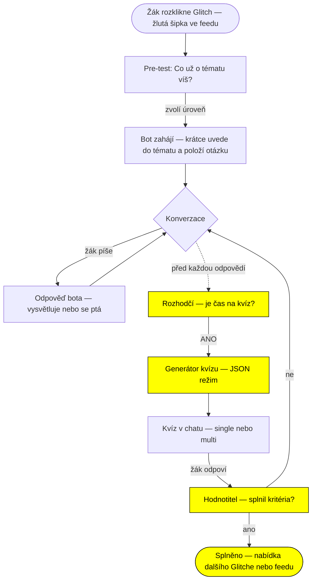
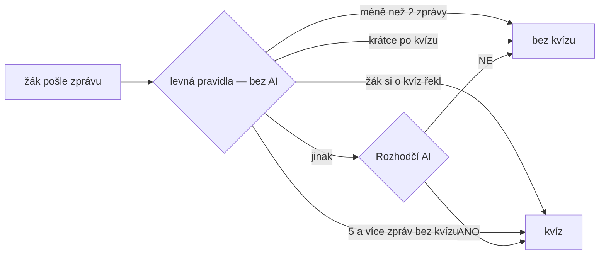
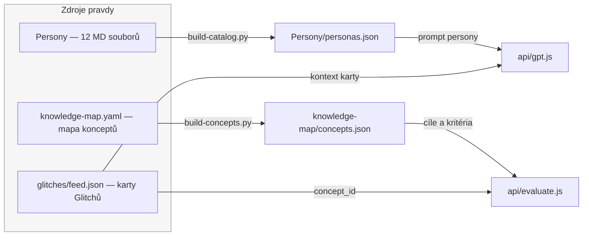
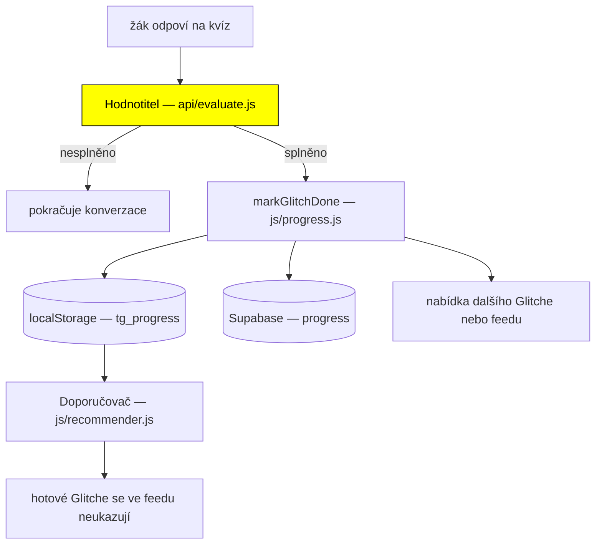

# Tok Basic Glitche — co se spouští kdy

Co se děje od chvíle, kdy žák rozklikne Basic Glitch, až po jeho splnění.
Kde jsou **zdroje**, kdy běží **která AI funkce** a co se **kam zapisuje**.

> Doplňkové dokumenty: `Persony/README.md` (persony a kvíz),
> `docs/doporucovani-implementace.md` (řazení feedu).

---

## 1. Celkový tok



Žlutě jsou **AI funkce**. Každá má jediný úkol — proto je spolehlivá.

---

## 2. AI funkce (kdy běží a proč zvlášť)

| Funkce | Kde | Kdy běží | Co vrací |
|---|---|---|---|
| **Konverzační bot** | `api/gpt.js` | při každé zprávě | text odpovědi |
| **Rozhodčí kvízu** | `api/gpt.js` → `shouldQuiz()` | jen když projdou levná pravidla | `ANO` / `NE` |
| **Generátor kvízu** | `api/gpt.js` → `generateQuiz()` | když rozhodčí řekne ANO | JSON kvízu |
| **Hodnotitel** | `api/evaluate.js` | po odpovědi na kvíz | `splneno`, `uroven`, `shrnuti` |

**Proč zvlášť:** konverzační bot má v personě „piš krátce, jednu otázku". Když
se po něm chtělo, aby uprostřed řeči vyrobil ještě JSON kvízu, většinou to
neudělal. Rozdělením na samostatná volání dostane každý model jeden jasný úkol.

### Kdy přijde kvíz (dvoustupňové rozhodnutí)



Levná pravidla šetří volání: rozhodčí se ptá jen tehdy, když má smysl.

---

## 3. Odkud se berou zdroje



- **Persony** = *jak* bot mluví. Vybírá se polem `persona` v kartě
  (jinak dle typu karty, jinak `glitchee`).
- **Karta Glitche** = *o čem* mluví (téma, název, úvodní text).
- **Mapa konceptů** = podle čeho se **hodnotí** (výukové cíle + kritéria),
  napojená přes `concept_id` karty.

⚠️ Po úpravě zdrojů je potřeba přegenerovat:
```bash
python3 Persony/build-catalog.py
python3 knowledge-map/build-concepts.py
```

---

## 4. Co se kam zapisuje



| Kam | Co | Kdy |
|---|---|---|
| `localStorage.tg_progress` | `{hotovo, kdy, uroven, shrnuti, concept_id}` | při splnění |
| `localStorage.tg_retry` | `{kdy, pokusy}` | při špatné odpovědi |
| Supabase `progress` | totéž, jen pro přihlášené | při splnění |

### Druhá šance

Špatná odpověď Glitch **neuzavírá**. Zapíše se do `tg_retry` a:
- v běžící relaci se karta **posune o ~8 karet níž**,
- při dalším načtení ji doporučovač zařadí dál od začátku.

---

## 5. Kdy je Glitch „hotový"

| Typ Glitche | Podmínka splnění |
|---|---|
| **Basic Glitch** (s chatem) | hodnotitel potvrdí, že žák splnil kritéria konceptu |
| **Rychlá výzva** (bez chatu) | správná odpověď (špatná → druhá šance) |

Hodnotitel má jedno tvrdé pravidlo: **počítá jen to, co žák prokazatelně řekl
sám.** Když všechno vysvětlil bot a žák jen přikyvoval, splněno není.

---

## 6. Co ještě není hotové

- [x] Zobrazit **vyhodnocení** při znovuotevření splněného Glitche
- [x] Zápis do `concept_mastery` (úroveň zvládnutí konceptu) — `tg_mastery` + Supabase
- [x] **Profil žáka do promptu** — co už žák zvládl (z `tg_mastery`) jde do
  systémového promptu chatbota jako blok „PROFIL ŽÁKA", ať může navázat na známé
  (`js/feed.js` → `buildZakProfil()`, `api/gpt.js` → `zakBlock()`)
- [x] **Mapa znalostí žáka** — heatmapa konceptů obarvená dosaženými úrovněmi
  v profilu (záložka Moje questy). Kostra: `knowledge-map/map-index.json`
  (`build-map-index.py`), obarvení z `tg_mastery` (`js/profile.js`)
