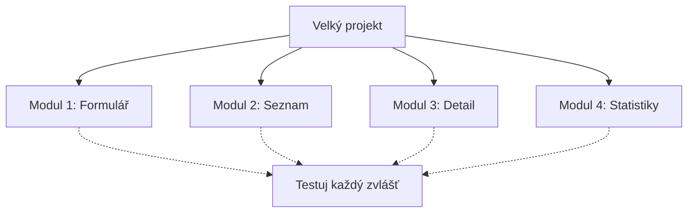

Největší chyba začátečníků: „Udělej mi celou aplikaci jako Instagram." AI to nezvládne — a ne proto, že je hloupá. Má omezené **kontextové okno** — množství textu, které si najednou pamatuje. Představ si to jako pracovní stůl: vejde se na něj jen určitý počet papírů. Když jich je moc, některé spadnou na zem.

**Pravidlo č. 1: Rozděl projekt na malé moduly.** Místo jedné obří aplikace udělej několik menších částí. Registrační formulář zvlášť. Seznam položek zvlášť. Každý modul řeš v samostatné konverzaci.

**Pravidlo č. 2: Nevynalézej kolo.** Použij hotové a ověřené věci — šablony, knihovny, frameworky. Když existuje hotový design systém, použij ho místo tvorby od nuly. Když existuje knihovna pro grafy, nepiš vlastní.

**Pravidlo č. 3: Postupuj od jednoduchého ke složitému.** Nejdřív základ, pak detaily. Nejdřív seznam položek, pak filtrování, pak řazení, pak design. Každý krok otestuj než přidáš další.

? Proč je lepší rozdělit velký projekt na menší části?
- Aby to vypadalo profesionálněji | Profesionální vzhled nesouvisí s velikostí modulů, ale s designem.
- Kvůli bezpečnosti dat | Bezpečnost dat je důležitá, ale není hlavním důvodem pro modulární přístup.
* Protože AI má omezené kontextové okno a lépe pracuje s menšími úkoly | Přesně! AI si najednou „pamatuje" jen omezené množství kódu, takže menší moduly = lepší výsledky.
- Protože menší projekty jsou levnější | Cena nesouvisí s modulárním přístupem — jde o omezení kontextového okna AI.
! Přesně! AI si najednou „pamatuje" jen omezené množství kódu. Menší moduly = lepší výsledky.

+++

**Proč je modulární přístup tak důležitý:**

Kontextové okno moderních AI modelů je typicky 100 000–200 000 tokenů (slov). Zní to hodně, ale celý kód středně velké aplikace má snadno 500 000+ tokenů. Když AI „vidí" jen část kódu, může změnit něco, co rozbije jinou část, kterou zrovna nevidí.

**Praktický příklad modulárního přístupu:**

Chceš vytvořit aplikaci pro sledování filmů? Rozděl ji:
- **Modul 1:** Formulář pro přidání filmu (název, rok, hodnocení)
- **Modul 2:** Seznam filmů s řazením a filtrováním
- **Modul 3:** Detail filmu s poznámkami
- **Modul 4:** Statistiky (kolik filmů, průměrné hodnocení)

Každý modul řeš samostatně. Když funguje, přejdi na další. Když se něco rozbije, víš přesně kde hledat.

**Co znamená „nevynalézej kolo":**

- Potřebuješ ikony? Použij Font Awesome nebo Lucide — stovky hotových ikon zdarma.
- Potřebuješ design? Použij Tailwind CSS nebo existující šablonu.
- Potřebuješ grafy? Použij Chart.js — řekni AI „použij knihovnu Chart.js pro graf."
- Potřebuješ mapy? Použij Leaflet nebo Google Maps API.

Řekni AI konkrétně jakou knihovnu má použít. „Použij Chart.js pro zobrazení sloupcového grafu" je 10x lepší než „Udělej mi hezký graf."
