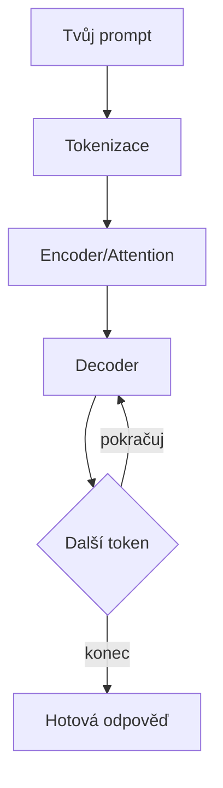

Když napíšeš prompt, AI ho nezpracovává jako člověk. Vstupní text se rozseká na **tokeny** — kousky slov (celé krátké slovo nebo část delšího). Slovo 'programování' jsou 2-3 tokeny. Kód se taky seká na tokeny — každý závorka, klíčové slovo, název proměnné.

Tyto tokeny vstoupí do **transformeru** — architektury neuronové sítě, kterou v roce 2017 vynalezli výzkumníci z Googlu (paper 'Attention Is All You Need'). Klíčový mechanismus je **self-attention**: pro každý token model spočítá, jak moc souvisí se všemi ostatními tokeny ve vstupu. Ve větě 'Kočka seděla na rohožce a olizovala si tlapky' attention mechanismus propojí 'tlapky' s 'kočka', ne s 'rohožka' — protože se naučil, že tlapky patří ke kočce.

Jazykové modely jako Claude nebo GPT používají **decoder** — část transformeru, která generuje výstup **token po tokenu**. Pro každý nový token model spočítá pravděpodobnostní rozložení přes celý slovník (desítky tisíc tokenů) a vybere jeden. Pak ho přidá ke vstupu a generuje další. Takhle vzniká celá odpověď — slovo po slově, ale s 'vědomím' celého předchozího kontextu.

? Jak transformer zpracovává vstupní text?
- Čte ho zleva doprava, slovo po slově, jako člověk | Tak fungovali starší modely (RNN). Transformer vidí celý vstup najednou díky attention.
* Zpracovává všechny tokeny najednou a pomocí attention počítá vztahy mezi nimi | Přesně! Self-attention umožňuje každému tokenu 'vidět' všechny ostatní a pochopit kontext.
- Hledá klíčová slova a podle nich vybere šablonu odpovědi | Transformer nepracuje s šablonami — generuje odpověď token po tokenu na základě naučených vzorů.
- Pošle text na internet a stáhne odpověď z databáze | AI nepřistupuje k internetu při generování — vše počítá lokálně v neuronové síti.
! Self-attention je klíč: každý token vidí všechny ostatní a model tak rozumí kontextu celé věty najednou.

+++

**Trénink vs. inference — dva různé režimy:**

Při **tréninku** model přečetl miliardy textů (knihy, web, kód z GitHubu, dokumentace). Pro každou pozici v textu se snažil předpovědět další token a porovnával svou předpověď se skutečností. Rozdíl (chyba) se zpětně propagoval sítí a upravil miliardy parametrů (vah). Claude má řádově stovky miliard parametrů. Trénink trvá měsíce na tisících GPU.

Při **inferenci** (když ti odpovídá) model dostane tvůj prompt, zpracuje ho přes attention vrstvy a pak decoder generuje odpověď token po tokenu. Každý token je výběr z pravděpodobnostního rozložení — proto při stejném promptu můžeš dostat různé odpovědi.

**Attention podrobněji:**

Self-attention počítá tři vektory pro každý token: **Query** (co hledám?), **Key** (co nabízím?) a **Value** (jakou informaci nesu?). Pro každý token se spočítá skóre podobnosti jeho Query se všemi Key — tím model zjistí, na které tokeny se má 'zaměřit'. Výsledek je vážený průměr Values. Moderní modely mají desítky attention hlav běžících paralelně — každá se zaměřuje na jiný typ vztahu (syntaktický, sémantický, pozicový).

**Reasoning modely — Claude, o1, Gemini Thinking:**

Novější modely umí 'přemýšlet' před odpovědí. Nejde o skutečné myšlení — model generuje řetězec mezikroků (chain-of-thought), kde každý krok zpřesňuje kontext pro další. Claude s extended thinking nejdřív vygeneruje analýzu problému (vidíš ji jako 'thinking'), a teprve pak odpověď. Díky tomu řeší složitější problémy — rozklad na podúlohy, kontrola vlastních kroků, zvážení alternativ. Je to stále predikce dalšího tokenu, ale s delším 'náběhem' který umožňuje komplexnější uvažování.

**Proč AI dělá chyby a 'halucinuje'?**

Model nemá 'paměť na fakta' — má statistické vzory. Když se zeptáš na konkrétní funkci knihovny, model generuje název, který je nejpravděpodobnější v daném kontextu — ale ta funkce nemusí existovat. Tomuto se říká **halucinace**. Reasoning modely halucinují méně (díky chain-of-thought kontrole), ale ne nulově.

**Kontextové okno:**

Každý model má limit kolik tokenů najednou zpracuje. Claude má ~200 000 tokenů, GPT-4 ~128 000. Celý kód středně velké aplikace má 500 000+ tokenů. Když pošleš víc než se vejde, model starší část 'zapomene'. Proto je modulární přístup tak důležitý — menší kontext = přesnější odpovědi.

**Temperature (teplota):**

Parametr, který ovlivňuje jak model vybírá z pravděpodobnostního rozložení. Nízká teplota (0.0-0.3) = vybírá nejpravděpodobnější token, výsledek je konzistentní a předvídatelný. Vysoká teplota (0.7-1.0) = dává šanci i méně pravděpodobným tokenům, výsledek je kreativnější ale méně spolehlivý. Pro generování kódu chceš nízkou teplotu.
